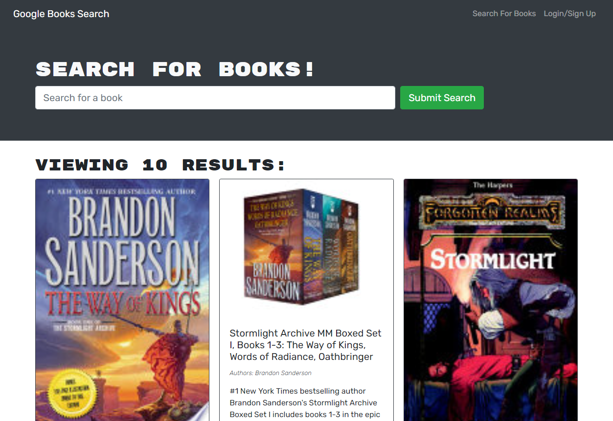

# Booklist Planner

## Description

This MERN stack application uses GraphQL to store stored books from the Googlebooks API.

## Deployment

To view the live deployment, [CLICK HERE](https://booklist-planner.herokuapp.com/).

## Questions

Please direct questions to my github at [esimondet](https://github.com/esimondet)
or email [edison.simondet@gmail.com](edison.simondet@gmail.com).
